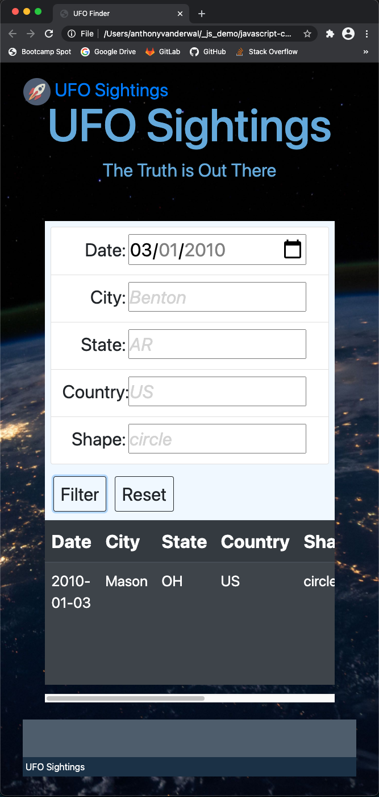
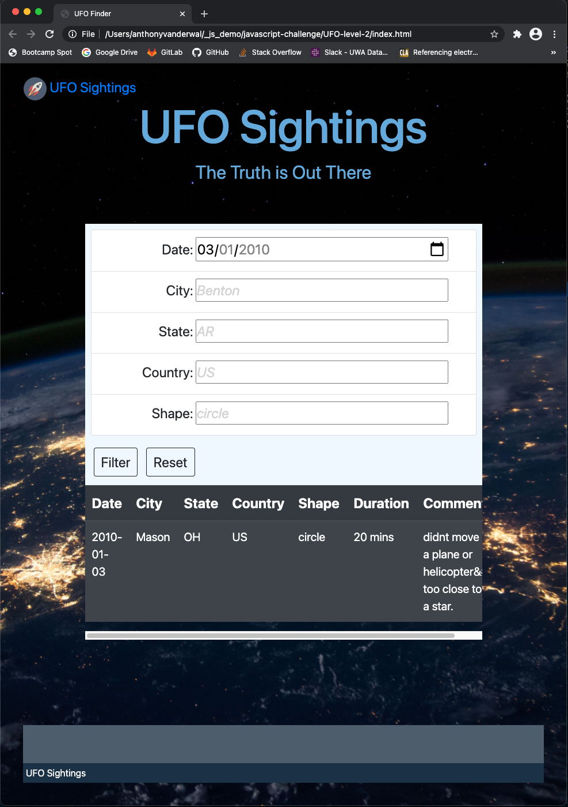
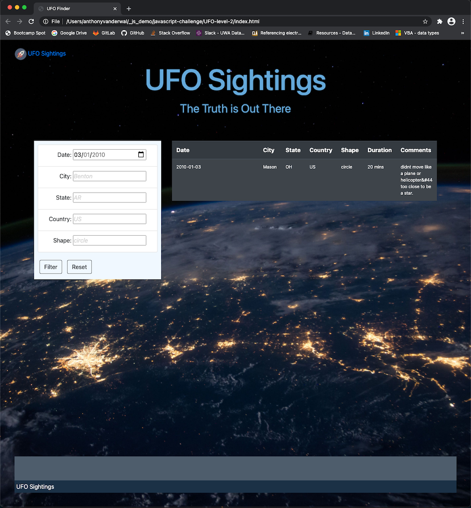

# javascript-challenge
- UWA Boot Camp Data Analytics
- Homework assignment 14 - JavaScript - Aliens-R-Real
- Anthony van der Wal - 14 December 2020
  

---
### Level 1
- [website](https://anthonyvanderwal.github.io/javascript-challenge/UFO-level-1/) level-1.
- [javascript](./UFO-level-1/static/js/app.js) app to render and filter table.
- [html](./UFO-level-1/index.html) template for website.
- [css](./UFO-level-1/static/css/style.css) with style for template.

---
### Code - level 2
- [javascript](./UFO-level-2/static/js/app.js) app to render and filter table.
- [html](./UFO-level-2/index.html) template for website.
- [css](./UFO-level-2/static/css/style.css) with style for template.

---
### Screenshots - level 2
**Website for small screen**  
<kbd></kbd>

**Website for medium screen**  
<kbd></kbd>

**Website for large screen**  
<kbd></kbd>

