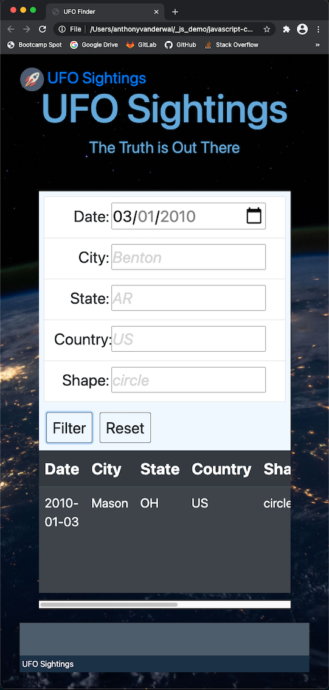

# javascript-challenge
- UWA Boot Camp Data Analytics
- Homework assignment 14 - JavaScript - Aliens-R-Real
- Anthony van der Wal - 14 December 2020
  

---
### Code
- [jupyter](./MarsMissions/mars.ipynb) notebook used to develop scraping code.
- [python](./MarsMissions/scrape_mars.py) app to scrape data for Flask.
- [flask](./MarsMissions/app.py) app to render template.
- [html](./MarsMissions/templates/index.html) template of website's main page.
- [css](./MarsMissions/static/style.css) with style for template.

---
### Screenshots
**Website for small screen**  
<kbd></kbd>

**Website for medium screen**  
<kbd></kbd>

**Website for large screen**  
<kbd></kbd>

